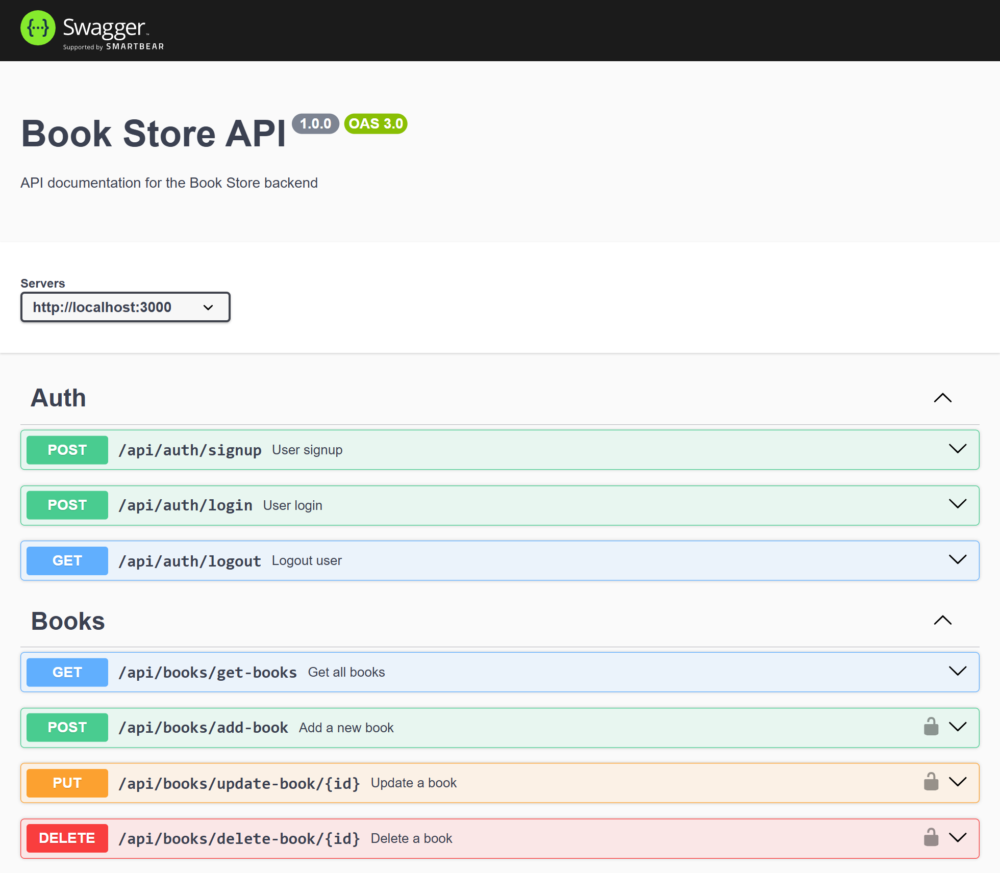

# 📚 Book Store Backend API

A secure and scalable **Book Store Backend API** built using **Node.js, Express, TypeScript, MongoDB, and JWT authentication**, with full API documentation via **Swagger UI**.

## 🚀 Features

- ⚡ TypeScript for enhanced type safety
- 🔐 JWT Authentication for secure access
- 📚 CRUD operations for managing books
- 🧱 Clean REST API architecture (routes, controllers, models, middleware)
- 🛡️ Helmet for security
- 🗂️ MongoDB with Mongoose
- 📘 Swagger UI for interactive API testing
- ☁️ Deployable on Vercel (Serverless functions)

## 🛠️ Tech Stack

- Node.js
- Express.js
- TypeScript
- MongoDB + Mongoose
- JWT Authentication
- Helmet
- Swagger UI

## 📁 Project Structure

```
src/
 ├── controllers/
 ├── routes/
 ├── models/
 ├── middleware/
 ├── utils/
 ├── swagger.ts
 └── index.ts

dist/ (compiled JS)

```

## 📘 API Documentation (Swagger UI)

Swagger UI provides an interactive interface for exploring and testing the API.



## 🔧 Installation & Setup

### Clone the repository

```
git clone https://github.com/Tarunsaisrinivas/Typescript-backend
cd Typescript-backend
```

### Install dependencies

```
npm install
```

### Create environment file

```
PORT=3000
MONGO_URI=your_mongodb_connection_string
JWT_SECRET=your_jwt_secret_key
```

### Start development server

```
npm run dev
```

### Build the project

```
npm run build
```

### Start production server

```
npm start
```

## 🔐 Authentication

This project uses JWT tokens.

Header example:

```
Authorization: Bearer <your_token_here>
```

## 📚 API Endpoints

### Auth Routes

| Method | Endpoint         | Description           |
| ------ | ---------------- | --------------------- |
| POST   | /api/auth/signup | Create new user       |
| POST   | /api/auth/login  | Login & receive token |
| GET    | /api/auth/logout | Logout user           |

### Book Routes

| Method | Endpoint                   | Protected | Description   |
| ------ | -------------------------- | --------- | ------------- |
| GET    | /api/books/get-books       | No        | Get all books |
| POST   | /api/books/add-book        | Yes       | Add a book    |
| PUT    | /api/books/update-book/:id | Yes       | Update book   |
| DELETE | /api/books/delete-book/:id | Yes       | Delete book   |

## 🤝 Contributing

Contributions are welcome! Open an issue or submit a pull request.

## 📄 License

Licensed under the MIT License.

## ⭐ Support

If you found this project useful, please ⭐ star the repository!
